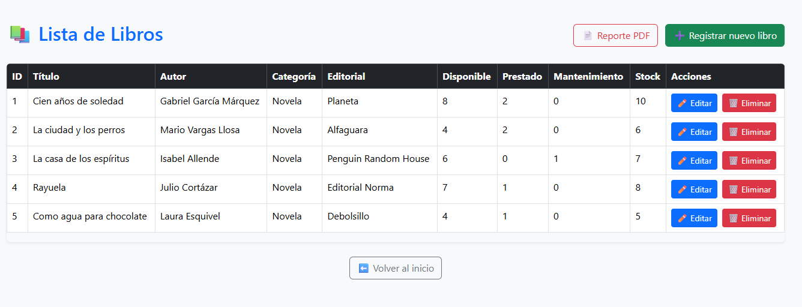
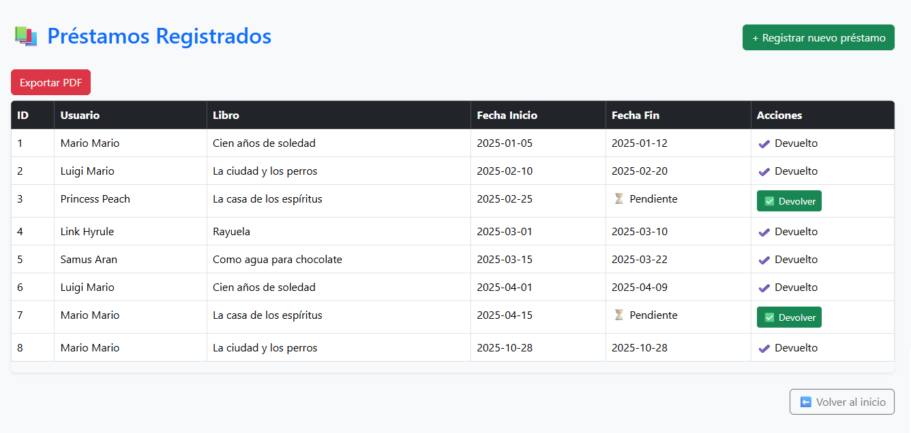

# 📚 Sistema de Gestión de Biblioteca

Aplicación web desarrollada con **Spring Boot** y **MySQL**, que permite la gestión de libros, préstamos y reportes mediante una arquitectura **MVC** y controladores **REST**.

---

## 🧩 Características principales
- Módulo de **Libros**: registro, edición, eliminación y búsqueda.
- Módulo de **Préstamos**: asignación de libros a usuarios, devoluciones y control de stock.
- Módulo de **Usuarios**: roles y autenticación.
- **Reportes automáticos** de préstamos y libros disponibles.
- Persistencia con **JPA (Hibernate)** y conexión a **MySQL**.
- Interfaz desarrollada con **Thymeleaf** o JSP (según versión).

---

## ⚙️ Tecnologías utilizadas
| Categoría | Tecnologías |
|------------|--------------|
| Lenguaje | Java 17 |
| Framework | Spring Boot 3.x |
| ORM | Hibernate / JPA |
| Base de Datos | MySQL |
| IDE | IntelliJ IDEA |
| Control de versiones | Git & GitHub |

---

## 🚀 Cómo ejecutar el proyecto
1. Clonar el repositorio:
   ```bash
   git clone https://github.com/jamirascencioflores/SistemaBiblioteca.git
   
2. Importar en IntelliJ IDEA o Eclipse como proyecto Maven.

3. Crear la base de datos en MySQL:
   ```bash
   CREATE DATABASE biblioteca_db;

4. Configurar las credenciales en application.properties:
   ```bash
   spring.datasource.url=jdbc:mysql://localhost:3306/biblioteca_db
   spring.datasource.username=tu_usuario
   spring.datasource.password=tu_contraseña

5. Ejecutar el proyecto con:
   ```bash
   mvn spring-boot:run
   
6. Acceder desde el navegador:
   ```bash
   http://localhost:8080

---
## 🧠 Estructura del proyecto
```bash
src/
├── main/
│   ├── java/com/jamir/biblioteca/
│   │    ├── controller/        # Controladores REST y web
│   │    ├── model/             # Entidades JPA
│   │    ├── repository/        # Repositorios (DAO)
│   │    └── service/           # Lógica de negocio
│   └── resources/
│        ├── application.properties
│        ├── static/            # Archivos estáticos (CSS, JS, imágenes)
│        ├── templates/         # Vistas Thymeleaf / JSP
│        └── sql/               # Scripts SQL (estructura, datos y vistas)
│             ├── schema.sql
│             ├── data.sql
│             └── biblioteca_vistas.sql
└── test/

```
---
### 📁 Scripts SQL incluidos
| Archivo                   | Descripción     |
|---------------------------|-----------------|
| schema.sql                | Define la estructura de tablas y relaciones de la base de datos.       |
| data.sql                  | Contiene datos iniciales de autores, categorías, editoriales y clientes.|
| biblioteca_vistas.sql     | Incluye vistas SQL para reportes automáticos y análisis de préstamos. |

---
### 📊 Reportes automáticos (Vistas SQL)
El sistema incluye vistas predefinidas para generar reportes automáticos y consultas estadísticas:

| Vista                 | Descripción                                                      |
|-----------------------|------------------------------------------------------------------|
| vista_prestamos_detalle            | Muestra detalle de préstamos con cálculo de días y total a pagar. |
| vista_stock_libros            | Reporte del stock disponible, prestado y en mantenimiento por libro.                                                             |
| vista_libros_populares | Lista los libros más prestados ordenados por popularidad.        |

Puedes ejecutarlas directamente desde MySQL:

```bash
SELECT * FROM vista_prestamos_detalle;
SELECT * FROM vista_stock_libros;
SELECT * FROM vista_libros_populares;
```

---

### 🖼️ Capturas de pantalla

### 🏠 Pantalla principal


### 📚 Módulo de Libros


### 💳 Módulo de Préstamos


---
## 👨‍💻 Autor

**Jamir Ascencio Flores**  
📍 Lima, Perú

📧 [jamirascencio@gmail.com](mailto:jamirascencio@gmail.com)  
💼 [LinkedIn](https://www.linkedin.com/in/jamir-ascencio)  
🐙 [GitHub](https://github.com/jamirascencioflores)

---
